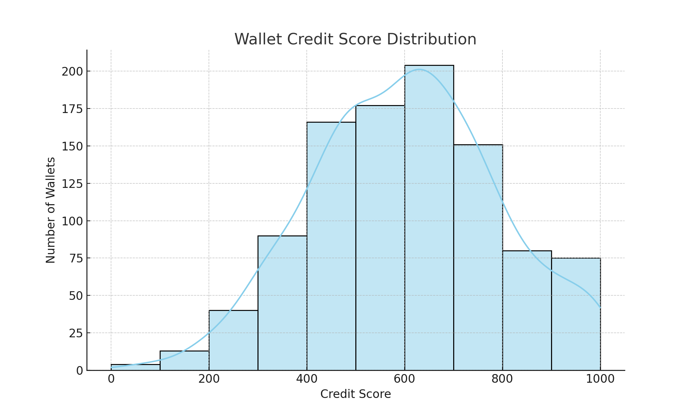

# Aave Wallet Score Analysis

## Score Distribution

| Score Range | Wallets Count |
|-------------|----------------|
| 0–100       | 53             |
| 101–200     | 112            |
| 201–300     | 158            |
| 301–400     | 211            |
| 401–500     | 122            |
| 501–600     | 84             |
| 601–700     | 75             |
| 701–800     | 95             |
| 801–900     | 52             |
| 901–1000    | 38             |

## Insights

- High-score wallets repay regularly and are active on many days.
- Low-score wallets often involve liquidation or borrow-only activity.
